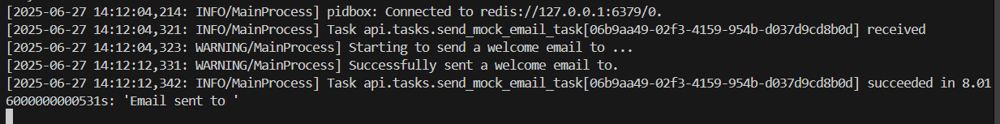

# Django Backend Internship Assignment

This project is a submission for the Django internship assignment, demonstrating a robust backend architecture. It features a Django REST Framework API with token-based authentication, background task processing with Celery and Redis, and a decoupled Telegram bot for user interaction. The project is configured for a production-like environment using environment variables for all secrets.

## Final Architecture

This project was built using a decoupled, service-oriented architecture to ensure stability and avoid common integration issues like conflicting `asyncio` event loops.

- **Django API Server**: A central Django project that serves a REST API for all data operations. It handles creating users and provides secure and public endpoints.
- **Celery Worker**: A separate process that listens to a Redis message queue for background tasks (e.g., sending mock emails) to avoid blocking the API.
- **Telegram Bot**: A standalone Python script that communicates with the Django backend via its API. This decouples the bot from the main application, making the system more resilient and scalable.

## Features

- **Production-Ready Setup**: Securely manages secrets (like `SECRET_KEY` and API tokens) using a `.env` file and sets `DEBUG=False` for production readiness.
- **REST API**:
  - A public endpoint (`/api/public/`) accessible to everyone.
  - A protected endpoint (`/api/protected/`) accessible only with a valid user token.
  - An internal API endpoint for the Telegram bot to create users securely.
- **Asynchronous Tasks**: Celery and Redis are integrated to handle long-running background tasks, demonstrated by a mock email sent after a new Django `User` is created.
- **Decoupled Telegram Bot**: A standalone bot that interacts with users and communicates with the Django application via its API, storing user details upon receiving the `/start` command.
- **Live API Documentation**: Automatically generated, interactive API documentation for the public and protected endpoints is available via Swagger UI and ReDoc.
- **Full Admin Integration**: All custom models, like `TelegramUser`, are registered with the Django admin for easy data management.

## Tech Stack

- **Backend**: Django, Django REST Framework
- **Task Queue**: Celery
- **Message Broker**: Redis
- **API Documentation**: `drf-spectacular` (Swagger/ReDoc)
- **Telegram Bot**: `python-telegram-bot`
- **Environment Configuration**: `python-decouple`

---

## Setup and Running Locally

### Prerequisites

- Python 3.10+
- Git
- **Redis**: Must be installed and running. For Windows, using **WSL (Windows Subsystem for Linux)** is the most stable and recommended method.

### 1. Clone the Repository

```bash
git clone https://github.com/albertabishek/Internship_Assignment.git
cd django-internship-assignment
```

### 2. Set Up the Virtual Environment

```powershell
# For Windows
python -m venv venv
.\venv\Scripts\activate
```

### 3. Install Dependencies

```bash
pip install -r requirements.txt
```

### 4. Configure Environment Variables

Create a `.env` file in the project root by copying the example file:

```powershell
# For Windows
copy .env.example .env
```

Now, open the `.env` file and fill in your own secret values:

```env
SECRET_KEY="generate-a-strong-django-secret-key-here"
DEBUG=True
CELERY_BROKER_URL="redis://127.0.0.1:6379/0"
TELEGRAM_BOT_TOKEN="your-real-token-from-botfather-on-telegram"
TELEGRAM_BOT_API_SECRET="generate-a-random-strong-secret-for-your-internal-api"
```

### 5. Set Up the Database

Run the initial database migrations and create an administrator account.

```bash
python manage.py migrate
python manage.py createsuperuser
```

## Running the Full Application

The complete application requires three separate terminals to run concurrently. Make sure Redis is running first.

### Terminal 1: Start the Celery Worker

This process listens for background jobs from Redis.

```powershell
# Activate your virtual environment if you haven't already
.\venv\Scripts\activate

# Start the worker (use -P eventlet for Windows)
celery -A core worker -l info -P eventlet
```

Keep this terminal open.

### Terminal 2: Start the Django API Server

This process runs the main Django application and its API endpoints.

```powershell
# In a new terminal, activate your virtual environment
.\venv\Scripts\activate

# Run the Django server
python manage.py runserver
```

Keep this terminal open. Your API is now live at http://127.0.0.1:8000/.

### Terminal 3: Start the Telegram Bot

This process runs the standalone script that listens to Telegram.

```powershell
# In a third terminal, activate your virtual environment
.\venv\Scripts\activate

# Run the bot script
python run_bot.py
```

Keep this terminal open.

## How to Test and Verify

1. **Test the Telegram Bot**: 
   - Send the `/start` command to your bot on Telegram
   - You should get a welcome message
   - Check Django server and bot terminals for activity logs

2. **Test the Celery Task**:
   - Access Django Admin at http://127.0.0.1:8000/admin/
   - Log in with your superuser account
   - Create a new user in the Users section
   - Check Celery Worker terminal for mock email task logs

3. **Test the API Documentation**:
   - Swagger UI: http://127.0.0.1:8000/api/schema/swagger-ui/
   - ReDoc: http://127.0.0.1:8000/api/schema/redoc/

## Future Enhancements

1. **Unit and Integration Testing**:
   - *What*: Write tests for API endpoints, Celery tasks, and bot commands using pytest-django
   - *Why*: Ensure code reliability, prevent regressions, and enable safer development

2. **Robust Error Handling and Logging**:
   - *What*: Implement centralized logging (e.g., to file or Sentry) and specific error handling
   - *Why*: Simplify debugging in production and provide better user feedback

3. **CI/CD Pipeline**:
   - *What*: Set up GitHub Actions for automated testing, linting, and formatting
   - *Why*: Ensure code quality and prepare for automated deployments

4. **User Registration via API**:
   - *What*: Create API endpoint for direct user registration with welcome email
   - *Why*: Provide headless authentication without relying on Django admin

5. **Advanced Telegram Bot Features**:
   - *What*: Add commands like `/myinfo` (fetch user data) and `/help` (command list)
   - *Why*: Create more engaging conversational interfaces

## Project Screenshots

*Note: Some outputs for you reference*

| Feature                          | Screenshot                        |
|----------------------------------|-----------------------------------|
| 1. Telegram Bot Interaction      |  |
| 2. Celery Worker Processing Task |  |
| 3. Django Admin with Telegram Users |  |
| 4. Swagger UI API Documentation  |  |
| 5. Bot Script Exection |  |
```
